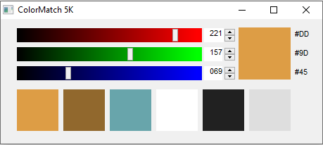
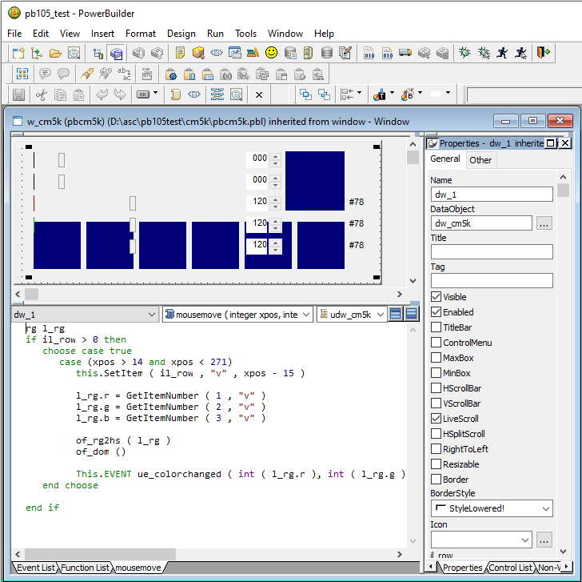

# PowerBuilder 10.5 ColorMatch 5K

A conversion of the famous ColorMatch 5K from HTML/Javascript to PowerBuilder.

I was fun to code the color slider control using a Datawindow.

The code is now more than 15 years old. 

Time for the PowerBuilder Junkyard!

