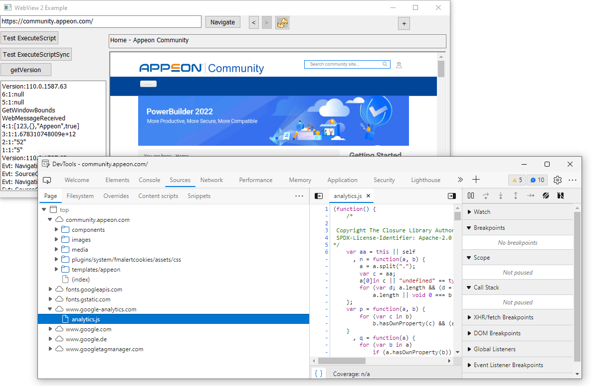
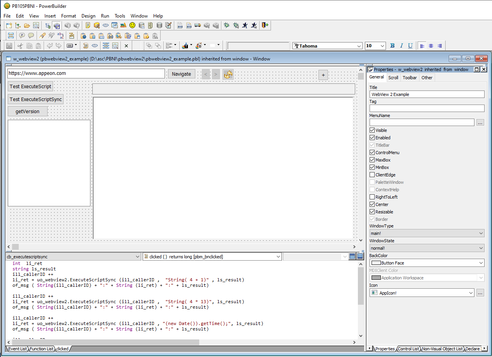

# PowerBuilder 10.5 WebView 2 Example (Proof of Concept)

I started this PBNI project back in 2020 to use the Microsoft WebView2 Control in PowerBuilder 10.5 (and up).

Yes, it works ... but the PowerBuilder Event Queue and the Single Threaded VM made me crazy.

Appeon maintained the WebBrowser Control and uses the Microsoft WebView2 since Mid of 2023 in new PowerBuilder releases.

So here it goes.

Time for the PowerBuilder Junkyard! ;-)